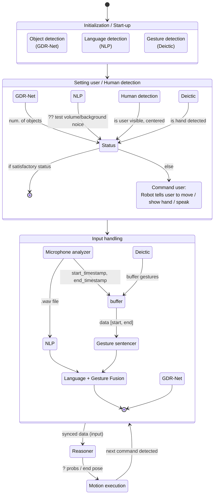

# reasoner_docker_pipeline
Repository of docker containers for running Reasoner module from iChores project on Tiago++. 

Included is the newer version of Reasoner module from Michal Procházka [@MikeHubXP](https://github.com/MikeHubXP) from his thesis. Both versions of Reasoner used packages from Imitrob project particularly [teleop gesture toolbox](https://github.com/imitrob/teleop_gesture_toolbox/tree/main), whose most active author (maintener) is Petr Vanc [@petrvancjr](https://github.com/petrvancjr).
***
## Structure
Main [docker-compose.yml](docker-compose.yml) that starts (builds, on fisrt compose up) a melodic, noetic and ros2 container. Both ROS1 containers connects, by default, to `ROS_MASTER_URI=http://tiago-114c:11311` with `ROS_IP=127.0.0.1`. ROS2 container runs separetly with implemented bridging to download and upload messages from topics.

There are also 3 workspace directories, `melodic_ws/`, `noetic_ws/` and `ros2_ws/` each containing additional ros packages that are build on container startup *(when implementations and packages stabilize, they should be moved inside docker images)*. Each `entrypoint.sh` looks for packages inside these directories for packages to build.

Lastly, tiago_sim folder contains docker container for simulating Tiago++ `roscore`. [docker-compose.yml](tiago_sim/docker-compose.yml) starts Tiago++ simulation with the additional noetic and ros2 containers connected to it instead of robot. *Side note: Simulation container is not setup to use GPU, my remote device does not have one. So if you try simulation on a device with GPU and manage to run the sim on it, please do not hesitate to make an issue or push the solution here.*
***
## Melodic
Docker only useful for running with Prague Tiago++, that operates on ROS1 melodic.
Runs one simple package that bridge arm control commands from noetic to melodic. Imported using git submodule to Prague [github](git@github.com:ichores-research/Motion_stack.git).

## Noetic
Runs bridging packages, from noetic to melodic and to ros2 and by default it import gdrnet services and messages (`object_detector_msgs`) using git submodule to Vien [github](git@github.com:v4r-tuwien/object_detector_msgs.git).

## ROS2 humble
Runs packages from Michal Procházka (master thesis) and from Petr Vanc (teleop toolbox). Go inside [ros2_ws](ros_ws/) to see all the used packages.

## Installation
Build all images at once using the [docker-compose.yml](docker-compose.yml) like this:
```
docker compose up
```
or separetly by going to each subdirectory in [src/](src/) and running this command:
```
docker build -t <name-from-compose-yml> .
```

Similar process is with the [tiago_sim](tiago_sim/), `docker compose up` or `docker build -t <name> .` in src/ subdirectory of repo root.
***
## Reasoner, pipeline develompment
Currently *(August 2025)* there are being made improvements, mainly modularization so reasoning part can be delegated to neural network and reduction of time complexity.
There is also a idea of making script for running the whole ichores pipeline.
### Structure
